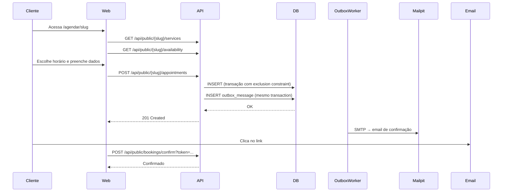

# AgendaFlow

Sistema SaaS multi-tenant para agendamento de serviços. Empresas como barbearias, salões, estúdios e prestadores de serviços podem cadastrar serviços e profissionais, configurar disponibilidade e disponibilizar uma página pública de agendamento.

## Como avaliar este projeto em 5 minutos

```bash
# 1. Subir o ambiente
cp .env.example .env
docker compose up --build

# 2. Acessar
# Frontend:  http://localhost:5173
# Swagger:   http://localhost:8080/swagger
# Mailpit:   http://localhost:8025  (emails de desenvolvimento)

# 3. Credenciais locais (seed de desenvolvimento)
# Owner:   owner@horizonte.local / dev_password
# Manager: manager@horizonte.local / dev_password
# Staff:   staff@horizonte.local / dev_password
# Slug da empresa: horizonte

# 4. Fluxo principal para testar
# a) Login como owner → criar serviço → criar profissional → configurar disponibilidade
# b) Acesse /agendar/horizonte → escolha serviço → horário → preencha dados → confirme e-mail (Mailpit)

# 5. Testes
dotnet test tests/AgendaFlow.UnitTests/          # unitários (sem dependências externas)
dotnet test tests/AgendaFlow.IntegrationTests/   # requer Docker
cd src/AgendaFlow.Web && npm test                # frontend

# 6. Decisões arquiteturais
ls docs/decisions/
```

---

## Problema resolvido

Pequenos negócios que trabalham com horário marcado precisam de uma forma de disponibilizar agendamentos online sem depender de planilhas ou WhatsApp. O AgendaFlow oferece uma página pública de agendamento configurável por empresa, com confirmação por e-mail e painel de gestão.

## Funcionalidades

- Cadastro de empresa e onboarding guiado
- Gestão de serviços (duração, preço, buffers)
- Gestão de profissionais e seus serviços
- Configuração de disponibilidade semanal com exceções
- Página pública de agendamento por slug da empresa
- Confirmação de agendamento por link no e-mail
- Cancelamento por link no e-mail
- Painel de agendamentos com filtros
- Dashboard com indicadores reais
- Planos com limites verificados no servidor
- Múltiplos papéis: Owner, Manager, Staff

## Destaques Técnicos

**Isolamento multi-tenant com defesa em profundidade.** O TenantId nunca vem do cliente — é resolvido da sessão no servidor. EF Core aplica filtros globais em todas as queries. PostgreSQL aplica Row-Level Security como camada adicional independente da aplicação.

**Prevenção de double-booking no banco.** Uma `EXCLUSION CONSTRAINT` do PostgreSQL com `tstzrange` e `btree_gist` garante que dois agendamentos ativos do mesmo profissional não se sobreponham, independente de quantas instâncias da API estejam rodando.

**Notificações garantidas com Outbox Pattern.** Emails são escritos na mesma transação do agendamento. Um `BackgroundService` processa a fila com retry exponencial.

**Autenticação com cookies HttpOnly.** Sem JWT em localStorage. CSRF protegido por header `X-XSRF-TOKEN`.

## Arquitetura

Monólito modular com Clean Architecture pragmática. Sem microserviços — o produto não tem requisito de escala independente que justifique essa complexidade.

```
AgendaFlow.Domain        → entidades, regras, exceções (sem dependências)
AgendaFlow.Application   → casos de uso, DTOs, contratos
AgendaFlow.Infrastructure→ EF Core, Identity, Email, Outbox
AgendaFlow.Api           → controllers, middleware, configuração
AgendaFlow.Web           → React + TypeScript
```

Para detalhes: [docs/architecture.md](docs/architecture.md)

## Fluxo de agendamento



## Segurança

- Cookies HttpOnly + SameSite=Strict
- CSRF com header X-XSRF-TOKEN
- Rate limiting por endpoint (5 req/min no login)
- Respostas anti-enumeração de contas
- Security headers (CSP, X-Content-Type-Options, etc.)
- Tokens de confirmação armazenados como hash SHA-256
- Tokens de recuperação one-time com expiração

Para detalhes: [docs/security.md](docs/security.md) · [docs/security/threat-model.md](docs/security/threat-model.md)

## Tecnologias

| Camada | Tecnologia |
|--------|-----------|
| Backend | .NET 10, C#, ASP.NET Core |
| ORM | Entity Framework Core 10 + Npgsql |
| Identidade | ASP.NET Core Identity |
| Banco | PostgreSQL 16 |
| Email (dev) | Mailpit |
| Frontend | React 19, TypeScript, Vite |
| Roteamento | React Router v7 |
| Data fetching | TanStack Query v5 |
| Formulários | React Hook Form + Zod |
| Testes backend | xUnit + FluentAssertions |
| Testes frontend | Vitest + Testing Library |
| Containers | Docker + Docker Compose |

## Como executar

```bash
# Requisitos: Docker 24+, Docker Compose v2

git clone <repo>
cd agendaflow
cp .env.example .env
docker compose up --build

# Aguardar ~30s para migrations e seed
```

Serviços disponíveis:

| Serviço | URL |
|---------|-----|
| Frontend | http://localhost:5173 |
| API | http://localhost:8080 |
| Swagger | http://localhost:8080/swagger |
| Mailpit | http://localhost:8025 |

## Usuários locais de demonstração

Empresa: **Clínica Horizonte** (slug: `horizonte`)

| E-mail | Papel | Senha |
|--------|-------|-------|
| owner@horizonte.local | Owner | dev_password |
| manager@horizonte.local | Manager | dev_password |
| staff@horizonte.local | Staff | dev_password |

Não reutilize essas credenciais em produção.

## Testes

```bash
# Unitários (sem dependências externas — rodam sempre)
dotnet test tests/AgendaFlow.UnitTests/

# Integração (requer Docker)
dotnet test tests/AgendaFlow.IntegrationTests/

# Frontend
cd src/AgendaFlow.Web
npm test
```

Cobertura focada em: regras de disponibilidade, máquina de estados do agendamento, buffers, isolamento multi-tenant, concorrência.

## Estrutura do repositório

```
src/
  AgendaFlow.Domain/          entidades e regras de negócio
  AgendaFlow.Application/     casos de uso e contratos
  AgendaFlow.Infrastructure/  EF Core, repositórios, email, outbox
  AgendaFlow.Api/             controllers, middleware, Program.cs
  AgendaFlow.Web/             frontend React
tests/
  AgendaFlow.UnitTests/       testes unitários
  AgendaFlow.IntegrationTests/testes de integração (Testcontainers)
docs/
  decisions/                  ADRs
  security/                   threat model
  architecture.md
  security.md
  deployment.md
  api-examples.http
docker/
  Dockerfile.api
  Dockerfile.web
  init-db.sql
  migrations/
```

## Decisões e trade-offs

**Monólito modular:** implantação simples, transações locais, separação clara de responsabilidades. Se houver necessidade futura de escalar componentes independentemente, a separação modular facilita a extração. Ver [ADR-001](docs/decisions/ADR-001-monolith-vs-microservices.md).

**Cookies em vez de JWT:** mais seguro para SPAs — XSS não consegue roubar a sessão. Exige CSRF protection. Ver [ADR-002](docs/decisions/ADR-002-cookies-vs-jwt.md).

**Exclusion constraint para concorrência:** garantia no banco, sem locks explícitos e sem necessidade de Redis. Ver [ADR-003](docs/decisions/ADR-003-appointment-concurrency.md).

**Schema compartilhado para multi-tenancy:** operação simples, isolamento suficiente com três camadas (TenantContext + EF filters + RLS). Migração para schemas separados seria possível se um tenant precisasse de isolamento físico.

## Limitações conhecidas

- MFA TOTP não implementado (roadmap)
- Exportação de dados do tenant (LGPD) não implementada (roadmap)
- Backup automatizado não configurado — responsabilidade do operador
- Testes de integração requerem Docker disponível no ambiente de CI
- Sem zero-downtime deploy sem orchestrator

## Roadmap

- MFA TOTP
- Exportação de dados (LGPD)
- Integração de pagamento (abstração já preparada)
- Notificações por SMS
- Lembretes automáticos antes do horário
- Relatórios exportáveis
- Múltiplos tenants por usuário com seletor na interface

## Autor

Desenvolvido como projeto de portfólio para demonstrar domínio de .NET, ASP.NET Core, Entity Framework, React/TypeScript, segurança de aplicações web e arquitetura de software.
